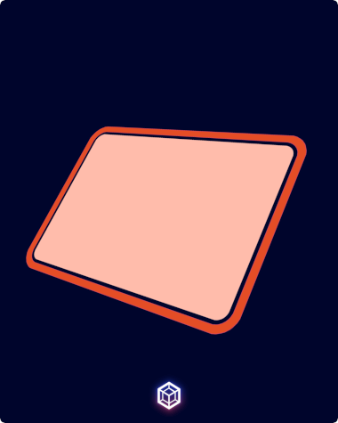

# Hi👋, I'm Lucas Lira
 
### A passionate frontend developer from Brazil

I've been working in the README code, soon this will be finished.

- 📚 Studying programming to become a programmer
  
- 👀 Actually exploring the **Front-End Technologies**
  
- 🌱 I’m currently learning **JavaScript, Python and Algorithm**

- 👯 I’m looking to collaborate on **small projects**

- 💬 Ask me about **HTML and CSS**

## 🛠️ Tech Stack

I have knowledge in:

  

    
    
  

  

    Tools I use:    
     &nbsp;
    
        
    

 

I've been studying:

 &nbsp;
 &nbsp;

### 🌐 Connect with me:

  <h2>⚙️ GitHub Analytics ⚙️</h2>

  <a href="https://github.com/lucsasl/github-readme-stats">
  
  

 

  

 

 
  
<b>Visitors Count</b>

  

